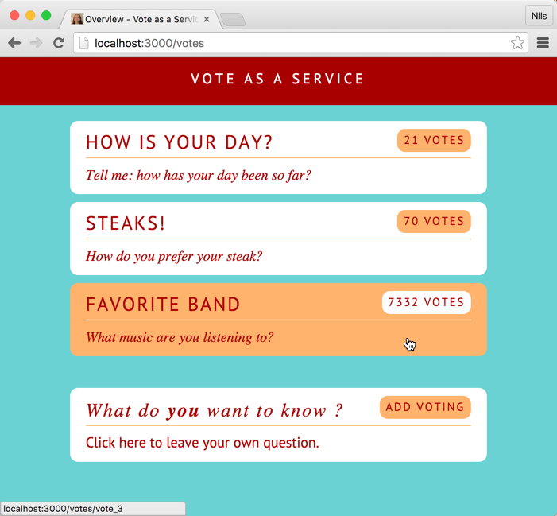

# React Vote Example

This is just another Universal Web App Example using the following tech stack:

* [React](https://facebook.github.io/react/)
* [React-Router](https://github.com/rackt/react-router)
* [redux](http://redux.js.org/)
* [babel-plugin-react-transform](https://github.com/gaearon/babel-plugin-react-transform) For hot reloading during development

Brought to you by [Oliver Zeigermann](http://zeigermann.eu/) and [Nils Hartmann](http://nilshartmann.net)



# Install and run

* Clone the repository
* run `npm install`
* run `npm start`
* Open the application in your webbrowser at `http://localhost:3000`. The first hit is completely rendered on server-side. All following interactions take place on the client-side.

## Developing

Instead of `npm start` you can run the server with an embedded webpack server that supports hot reloading of your react component. Start it with:
```
npm run server:hot
```

## Running tests

We have included a few unit- and integrationtests that you can run:

* `npm test` will run mocha with unit test (run `npm run test:cov` to get a coverage report)
* `npm run test:integration` will run integration tests based on Karma and PhantomJS

## Using MongoDB

If not configured otherwise, the Vote App will store it's data on the server just in memory. If you want to use MongoDb
for data storage, you can enable support by setting the `USE_MONGODB` environment variable to true when launching
the server process:
```
USE_MONGODB=true npm start
```

Before starting the server for the first time you can import some dummy data into your database by running
```
npm run import-mongodb-data
```

# Keep up-to-date

We plan to enhance this example application in future. To make sure you don't miss anything you can watch this repository
 or follow us on twitter [@nilshartmann](https://twitter.com/nilshartmann) (Nils) and [@djcordhose](https://twitter.com/jdcordhose) (Olli)

# Contribution

If you have any ideas for improvement, discover bugs or just want to give feedback, don't hesitate to open an [issue](https://github.com/nilshartmann/react-vote-example/issues)
or [pull request](https://github.com/nilshartmann/react-vote-example/pulls) in this repository.

# License

[MIT](LICENSE.md)


